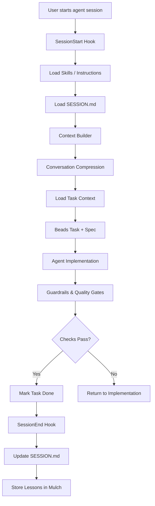

# AGENT_RUNTIME_FLOW.md

This document explains the runtime lifecycle of the AI engineering agent system.

It describes what happens when an agent session starts, executes tasks,
and completes work within the layered architecture.

---

# Runtime Overview



---

# Step‑by‑Step Runtime Lifecycle

## 1 Session Start

Triggered by:

```
agent start
```

or when an AI tool opens a new session.

Actions:

- run SessionStart hook
- load skills / instructions
- load SESSION.md

Purpose:

Restore the working context from the previous session.

---

# 2 Context Construction

The **Context Builder** assembles the prompt.

Order of injection:

```
skills / instructions
SESSION.md
conversation compression summary
recent conversation messages
beads task metadata
specification file
```

This ensures the model receives the most relevant information.

---

# 3 Conversation Compression

If the conversation exceeds the threshold (≈30 messages):

- older segments are summarised
- recent conversation turns are retained

Compression reduces token usage while preserving reasoning continuity.

---

# 4 Task Context Injection

When a task becomes active:

```
bd show <task>
```

The Beads plugin loads:

- task metadata
- dependencies
- spec path

This context is injected into the prompt.

---

# 5 Implementation Phase

The agent performs:

- code generation
- refactoring
- documentation updates
- test creation

This phase may iterate multiple times.

---

# 6 Guardrails & Quality Gates

When work approaches completion the validation pipeline runs.

Typical pipeline:

```
formatting
linting
type checking
unit tests
integration tests
agent review
```

If checks fail:

agent fixes issues and reruns pipeline.

---

# 7 Task Completion

If validation passes:

```
review → done
```

The task is updated in Beads.

---

# 8 Session End

Triggered by:

```
agent end
```

Actions:

- update SESSION.md
- optionally record new lessons into Mulch
- close runtime context

---

# Runtime State

Runtime-only data includes:

```
conversation segments
compression summaries
active prompt context
```

These remain **ephemeral** and are not written to the repository.

---

# System Responsibilities

| Layer          | Responsibility |
| -------------- | -------------- |
| Execution      | Beads          |
| Experience     | Mulch          |
| Knowledge      | Skills         |
| Conversation   | Compression    |
| Session Memory | SESSION.md     |
| Orchestration  | Hooks          |
| Validation     | Guardrails     |

---

# Design Goals

The runtime system aims to provide:

- safe autonomous development workflows
- predictable engineering behaviour
- minimal context bloat
- modular extensibility
