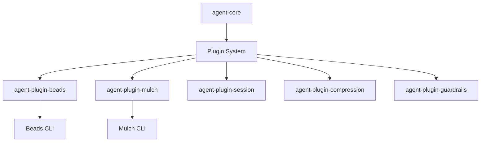
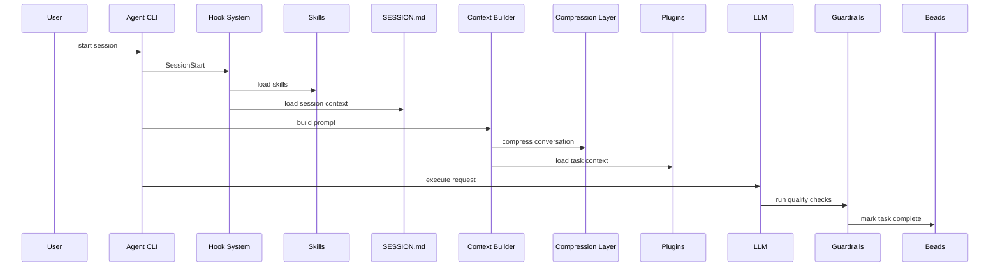

# ECOSYSTEM_REPO_STRUCTURE.md

This document describes the recommended repository layout for the
**agent ecosystem**.

The architecture separates the runtime core, plugins, and optional
stacks.

---

# Ecosystem Overview

---

# Recommended GitHub Organization

    agent-ecosystem/

        agent-core
        agent-plugin-beads
        agent-plugin-mulch
        agent-plugin-session
        agent-plugin-compression
        agent-plugin-guardrails

        agent-stack-standard
        agent-stack-minimal

---

# agent-core Repository

Responsible for runtime orchestration.

    agent-core/
        src/
            context-builder/
            hook-runner/
            plugin-loader/
            cli/
        docs/
        package.json

Responsibilities:

- plugin loading
- context construction
- hook execution
- CLI interface

---

# Plugin Repository Example

Example: **agent-plugin-beads**

    agent-plugin-beads/

        src/
            beadsAdapter.ts
            hooks.ts
            contextLoader.ts
        package.json

Responsibilities:

- call `bd` CLI
- read task metadata
- inject task context

---

# Standard Stack Bundle

Optional package that installs common plugins.

    agent-stack-standard/

        dependencies:
            agent-core
            agent-plugin-beads
            agent-plugin-mulch
            agent-plugin-session
            agent-plugin-compression
            agent-plugin-guardrails

Installation:

    npm install -g agent-stack-standard

---

# Repository Runtime Layout

After running:

    agent init

The repository may contain:

    repo/

    .agent/
        config.json
        hooks/

    .skills/

    .mulch/
        mulch.jsonl

    SESSION.md

---

# Agent Runtime Flow

---

# Design Goals

The ecosystem aims to achieve:

- modular extensibility
- minimal repository state
- tool‑agnostic integration
- safe autonomous workflows
